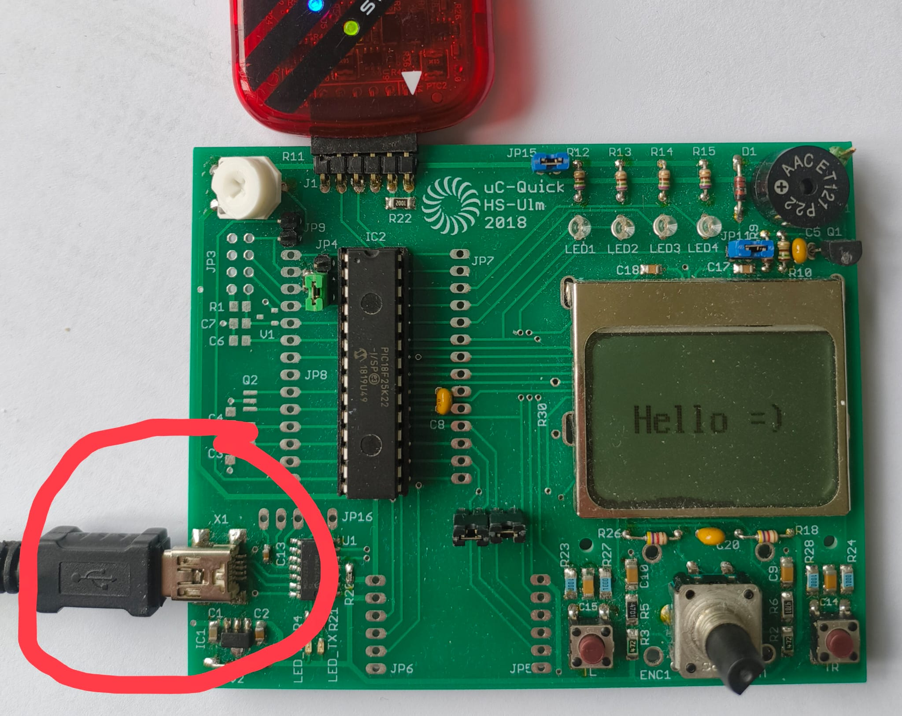
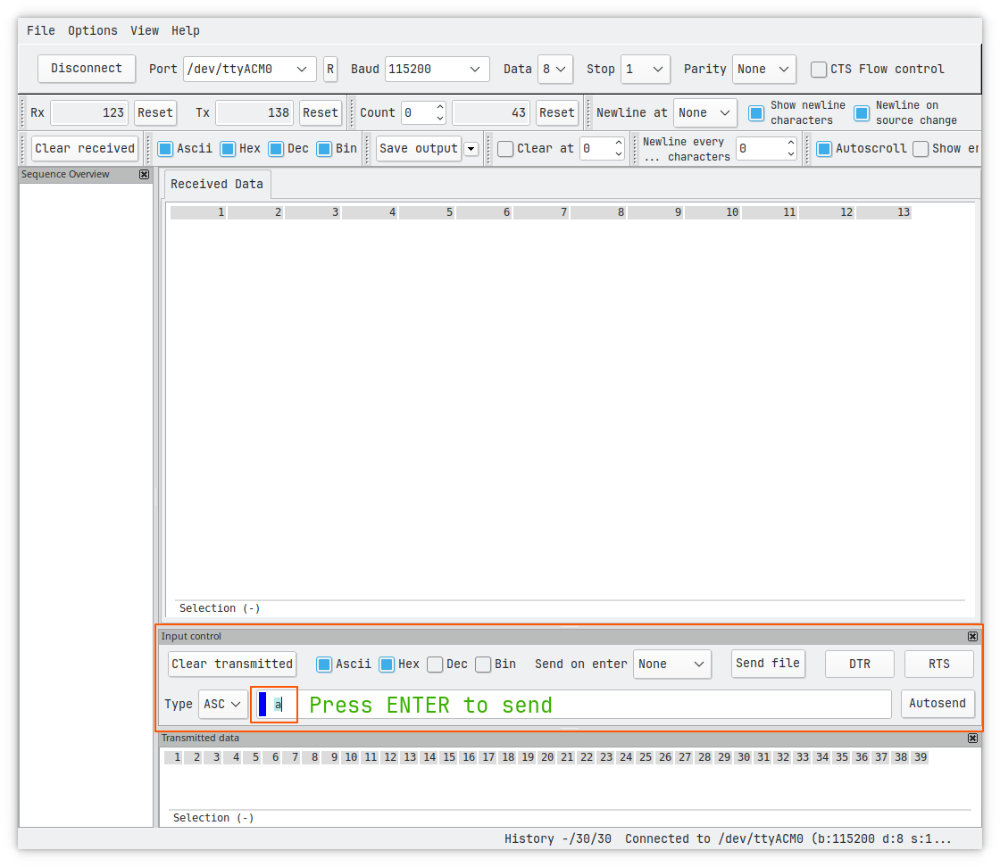

# Lab6_Serial_Communication
In today's laboratory, we will use the (E)USART module to interact with our Microcontroller.
Therefore, we will configure the module so that it enables asynchronous communication. This communication will take place between the Microcontroller an our PC (using [HTerm](https://fs.hs-ulm.de/public/mmunz/Lehre/MCON/programs/)).
>[!NOTE]
>click on the HTerm Link above and download hterm.exe to your PC. You will need it later!

Using this communication, we will then enable ourselves to write text to the LCD and start Analog to Digital Conversions.

>[!WARNING]
>Please ask for a second USB cable and connect it to the board as shown below. Connect the other side of the cable to you PC (into any USB-Port of your choice).
>

> [!TIP]
> In case you need the manual for Git again, click [here](https://github.com/MicrocontrollerApplications/Utilities/blob/main/git.md)
> If you need the development board's schematic, click [here](https://raw.githubusercontent.com/MicrocontrollerApplications/Lab2_InputOutput/refs/heads/main/images/uCquick_Board_2018_01.svg)
> The latest datasheet can be found [here](https://ww1.microchip.com/downloads/aemDocuments/documents/MCU08/ProductDocuments/DataSheets/PIC18%28L%29F2X-4XK22-Data-Sheet-40001412H.pdf)

## Relevant registers
For today's laboratory we will need the previously used registers to configure our Oscillator, I/O pins, Interrutps, Analog to Digital Conversion and the (E)USART registers introduced in the lecture. All relevant registers (except (E)USART) are listed below, for repetition. 
> [!NOTE]
> (E)USART registers will be explained on demand when necessary for an exercise.

<strong>Oscillator</strong>

<table>
<tr><th align="left">OSCCON</th><td>is used to set the frequency (IRCF)</td></tr>
</table>

<strong>I/O</strong>

<table>
<tr><th align="left">TRISB</th><td> sets the direction of a pin: "0" = output, "1" = input</td></tr>
<tr><th align="left">PORTB</th><td> reads the logic level at the pin: "0" = 0-0.8 V, "1" = Vdd (1.6-3.3 V or 2.0-5.0 V for TTL inputs)</td></tr>
<tr><th align="left">LATB</th><td> set the output voltage of a pin: "0" = 0 V, "1" = Vdd (3.3 V or 5 V)</td></tr>
<tr><th align="left">ANSELB</th><td> sets a pin as digital or analog: "0" = digital, "1" = analog</td></tr>
<tr><th align="left">OSCCON</th><td> sets the oscillator freq. E.g.: 0x50 = 4 MHz, 0x30 = 1 MHz. The instruction freq. are 1 MHz and 250 kHz respectively</td></tr>
<tr><th align="left"><i>Register</i>bits.X</th><td> TRISBbits.TRISB3 or LATBbits.LATB3 or PORTBbits.RB3 is the direct access to the bit 3 via a struct (see structures in C).</td></tr>
</table>

<strong>Interrupts</strong>

<table>
<tr><th align="left">INTCON</th><td>globally enable Interrupts, Peripheral Interrupts and Timer0 Interrupt. Read/Write Timer0 interrupt flag (overflow flag)</td></tr>
<tr><th align="left">INTCON2</th><td>configure interrupt behaviour for external signals (e.g. buttons)</td></tr>
<tr><th align="left">INTCON3</th><td>enable interrupts for special pins and read / write their interrupt flag</td></tr>
<tr><th align="left">PIR</th><td>contains the flags for peripheral interrupts</td></tr>
<tr><th align="left">PIE</th><td>contains the individual enable bits for the peripheral interrupts</td></tr>
</table>

<strong>Analog / Digital Conversion</strong>

<table>
<tr><th align="left">ADCON0</th><td>Select Channel (i.e. pin) as input for conversion, enable ADC-module, and start conversion.</td></tr>
<tr><th align="left">ADCON1</th><td>Select positive and negatie voltage reference.</td></tr>
<tr><th align="left">ADCON2</th><td>Configure justification of conversion result, Acquisition time, and conversion clock. </td></tr>
<tr><th align="left">ADRES</th><td>Read conversion result as 16 bit value. Use ADRESH and ADRESL to read result as two 8 bit values.</td></tr>
</table>

## Relevant chapters of the datasheet
We will use many of the available modules of our microcontroller today. Thus, the relevant chapters of the datasheet 
for today's laboratory are listed below.
- 2.0 OSCILLATOR MODULE (WITH FAIL-SAFE CLOCK MONITOR)
- 9.0 INTERRUPTS
- 10.0 I/O PORTS
- 16.0 ENHANCED UNIVERSAL SYNCHRONOUS ASYNCHRONOUS RECEIVER TRANSMITTER (EUSART)
- 17.0 ANALOG-TO-DIGITAL CONVERTER (ADC) MODULE

## Exercise 1 - fix initialization bug
To indicate that our laboratory board is up and running, the display should show a meaningful message (e.g. "Hello =)"). But this is not the fact.
If you start the prepared program of this laboratory session, you will see nothing on the display.
Find the reason for that and fix it.

## Exercise 2 - configure (E)USART module
First step for configuring our (E)USART module is to agree on a Baudrate that is used.
To get used to the handling of baud rates, we will agree on the two following ones
1. 19,200 Baud (19.2 kBaud)
2. 115,200 Baud (115.2 kBaud)

Calculate the according Serial Port Baud Rate Generator (SPBRG) value for both baud rates, using the given formula in the datasheet (see page 272).
>[!IMPORTANT]
>Assume below values for SYNC, BRG16, and BRGH to choose the correct formla from table 16-3
>SYNC = 0; BRG16 = 1; BRGH = 1
>Use the Round Half Up procedure (kaufmännisches Runden) for the result. If you are interested why, round the result up and down and calculate the resulting baud rates and errors for both results.
>$Error = \frac{Baudrate_{calculated}}{Baudrate_{desired}} - 1$

Now that you know the two relevant values for SPBRG, add them to your code (see position below).
https://github.com/MicrocontrollerApplications/Lab6_Serial_Communication/blob/94585897ba46ce567c4d0c2c969368213d2e4915/Lab6_Serial_Communication.X/main.c#L59-L62

Now, we need to investigate the provided function __Open1USART__. This a convenience function implemented to help you configuring the (E)USART module. 
To check this function uncomment below shown line of code, press and hold _STRG_ and click on the function. 
https://github.com/MicrocontrollerApplications/Lab6_Serial_Communication/blob/29a2903f40eddcf5d6606a43ee9e956a7af7c2e8/Lab6_Serial_Communication.X/main.c#L64
Now, a the source file containing Open1USART's implementation should have opened. If so, you can now investigate its functionality. If not, ask for help.

When done with analysis of __Open1USART__, repeat the procedure for __baud1USART__.

Analyze the code with the help of the datasheet. The relevant register therefore are:
<table>
<tr><th align="left">TXSTA1</th><td>configure transmission behavior of the USART module</td></tr>
<tr><th align="left">RCSTA1</th><td>configure receive behavior of the USART module</td><tr>
<tr><th align="left">BAUDCON1</th><td>configure behavior of Baudrate generator</td><tr>
<tr><th align="left">PIE1</th><td>enable / disbale interrupts for transmit / receive</td><tr>
</table>

>[!IMPORTANT]
>The provided convenience-function sets up it's own 8 bit configuration byte. Check the if/else statements within the function to reconstruct the bytes setup.
>Keep in mind the structure of hexadecimal representations:
>0x08 = 0b00001000
>0x20 = 0b00100000
>...
>It might be beneficial for you to write down the byte (e.g. 0b_abcdefgh_) and note each bits individual purpose, before setting up the configuration.

For the purpose of this laboratory, enable below listed functionalities:
- asynchronous mode for communication
- 8 bit mode
- high speed baud generation active
- 19.2 kBaud (we will use 115.2 kBaud later)

Now that those parameters are set, we need to use __baud1USART__ to configure the Baudrate generator so that it generates and interprets the relevant signals for us.
Therefore, go to page 271 of the datsheet and check the available configurations of __DTRXP__, __CKTXP__ and __BRG16__. Aks yourself how they can be used to realize below requirements.
1. _RX_ shall be active low
2. _TX_ shall be __idle__ high
3. 16 Bit Baudrate generator shall be used
4. Wake-Up shall be disabled
5. Auto-Baud detection shall be disabled

When everything is configured proceed to Exercise 3.

## Exercise 3 - check functionality
Now that everything is set up, we need to start HTerm on our Computer and plug in the second USB-cable (if not already done). 

Above image shows where the second USB cable needs to be plugged in (see red circle). The PICkit3 needs to be attached to be board as usual.
Now start hterm.exe and connect it with the development board.
If the drop-down menu in the top left corner (to the right of button "Connect") show multiple available COM ports, check your device manage (Gerätemenager in german) for the correct one.

If found, select the relevant COM-Port. Before clicking connect check the selected Baudrate. Is it the same you set in your code (19.2 kBaud)?
If so, click "Connect", otherwise change it and click "Connect" afterwards.
Now go back to MPLAB and start the execution of your code in Debug-Mode.
When done, check the following:
- Is the welcome message visible on the LCD?
- What happens if you send an 'a' to the board (see below picture for the procedure)
- now try to send a 't' to board and a "Hello" afterwards. What happens?
- you will now recognize that you can only send characters to the board, that are shown on the display. Find out why! (check the code)
- after you found out why the characters are written to the display, try to exit this operation mode. Therefore send a 0 (value not character) to the board. To do so, change the encoding from 'ASC' to 'Dec' in the drop-down menu left to the text filed you've previously written into.

If above tasks are done and everything works fine, you're done. If not, try to find out why.

If you want to, you can configure your code to use 115.2 kBaud (don't forget to configure HTerm, too) and check if you can see any difference.

## Exercise 4 - investigate baud rate limits (Experts only, not part of voting)
As we use the asynchronous mode of our (E)USART module, our communication depends on sufficiently precise oscillators for both communicating parties as well as a shared knowledge of the Baudrate.
You can now decrease the Baudrate until you're not able to receive the correct data on the microcontroller. Start with a 10% decrease and proceed in 10% steps until errors arise. As soon a an error arises, write down the Baudrate error and try to understand the error and it's root cause.
